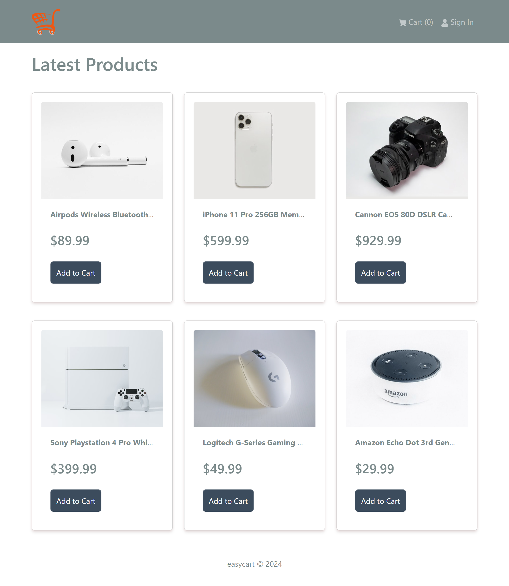
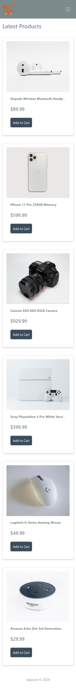
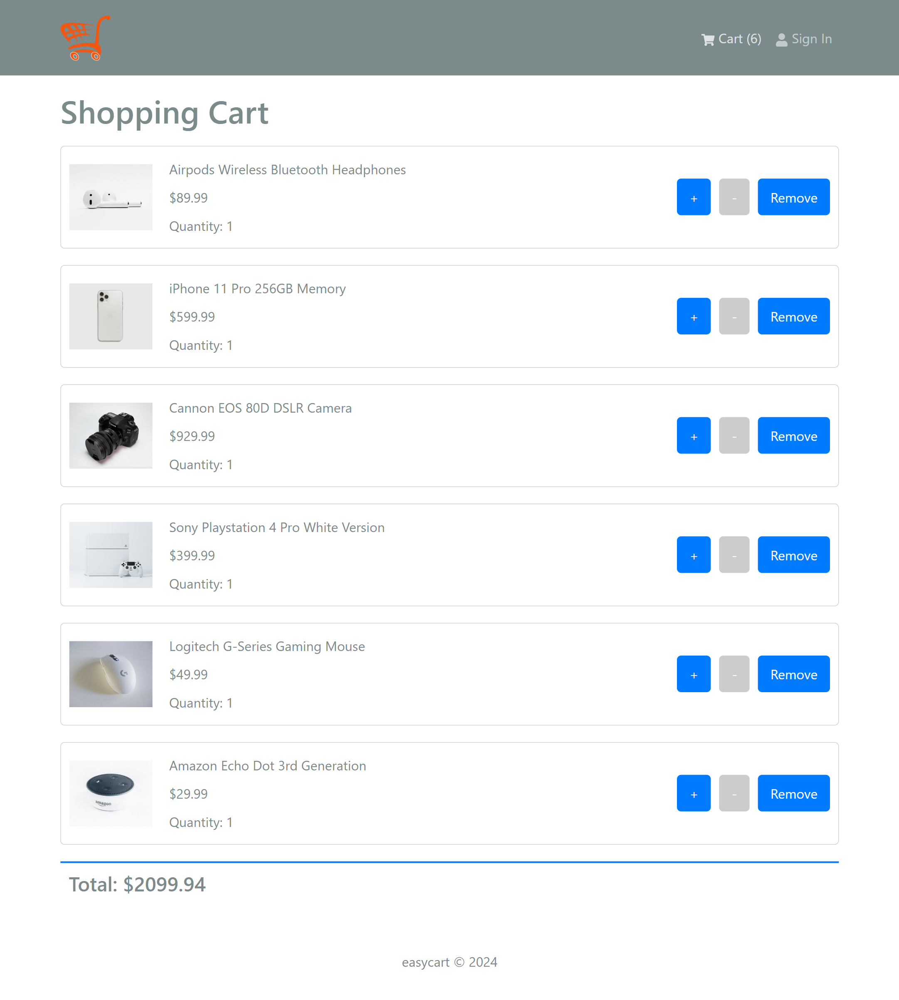
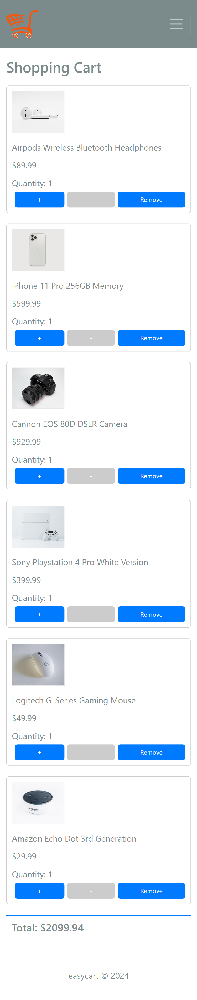

<a name="readme-top"></a>

<div align="center">
  
  <br/>

  <h3><b>EasyCart Application</b></h3>

</div>

<!-- TABLE  OF CONTENTS -->

# 📗 Table of Contents

- [📗 Table of Contents](#-table-of-contents)
- [📖 Shopping Cart Application ](#-shopping-cart-application-)
  - [🛠 Built With ](#-built-with-)
    - [Tech Stack ](#tech-stack-)
    - [Key Features ](#key-features-)
  - [🚀 Live Demo ](#-live-demo-)
  - [Screenshots of EasyCart](#screenshots-of-easycart)
    - [Home Screen - Desktop Version](#home-screen---desktop-version)
    - [Home Screen - Mobile Version](#home-screen---mobile-version)
    - [Cart Screen - Desktop Version](#cart-screen---desktop-version)
    - [Cart Screen - Mobile Version](#cart-screen---mobile-version)
  - [💻 Getting Started ](#-getting-started-)
    - [Prerequisites](#prerequisites)
    - [Setup](#setup)
    - [Install](#install)
    - [Usage](#usage)
  - [👥 Authors ](#-authors-)
  - [🔭 Future Features ](#-future-features-)
  - [🤝 Contributing ](#-contributing-)
  - [⭐️ Show your support ](#️-show-your-support-)

<!-- PROJECT DESCRIPTION -->

# 📖 Shopping Cart Application <a name="about-project"></a>

**EasyCart Application** is a simple project that allows users to manage products in a shopping cart. Users can add products to the cart, update product quantities, and remove products. This project is built using `ReactJS` & `Tailwind CSS` without a database, storing the product details in an array.

## 🛠 Built With <a name="built-with"></a>

### Tech Stack <a name="tech-stack"></a>

**This project was built using the following technologies:**

<details>
  <summary>Client</summary>
  <ul>
    <li><a href="https://reactjs.org/">React.js</a></li>
    <li><a href="https://getbootstrap.com/">Bootstrap</a></li>
  </ul>
</details>

<!-- Features -->

### Key Features <a name="key-features"></a>

**This project includes:**

- **Add products to the cart**
- **Update product quantities**
- **Delete products from the cart**

<p align="right">(<a href="#readme-top">back to top</a>)</p>

<!-- LIVE DEMO -->

## 🚀 Live Demo <a name="live-demo"></a>

**Check out the live demo of the project:**

- [Live Demo Link](https://easycart-liard.vercel.app/)

## Screenshots of EasyCart

### Home Screen - Desktop Version



### Home Screen - Mobile Version



### Cart Screen - Desktop Version



### Cart Screen - Mobile Version



<p align="right">(<a href="#readme-top">back to top</a>)</p>
<!-- GETTING STARTED -->

## 💻 Getting Started <a name="getting-started"></a>

**Follow these instructions to set up the project locally.**

### Prerequisites

**In order to run this project, you need:**

- A code editor (like VSCode)
- A browser to run the application
- Node.js (for local development, if using a framework like React)

### Setup

**Clone this repository to your desired folder:**

```sh
 git clone https://github.com/Chandan-devs-tech/easycart.git
```

### Install

**Install this project with:**

```sh
  cd easycart
  npm install
```

### Usage

**To run the project, execute the following command:**

```sh
  npm run start
```

<p align="right">(<a href="#readme-top">back to top</a>)</p>

<!-- AUTHORS -->

## 👥 Authors <a name="authors"></a>

👤 **Chandan Gupta**

- GitHub: [@githubhandle](https://github.com/Chandan-devs-tech)
- Twitter: [@twitterhandle](https://twitter.com/ChandanGuptaDev)
- LinkedIn: [LinkedIn](https://www.linkedin.com/in/chandangupta-devs)

<p align="right">(<a href="#readme-top">back to top</a>)</p>

<!-- FUTURE FEATURES -->

## 🔭 Future Features <a name="future-features"></a>

**This project is still under development.**

- [ ] **[Sort Products by Price or Popularity]**
- [ ] **[Pagination for Product List]**
- [ ] **[Product Categories and Tagging]**

<p align="right">(<a href="#readme-top">back to top</a>)</p>

<!-- CONTRIBUTING -->

## 🤝 Contributing <a name="contributing"></a>

**Contributions, issues, and feature requests are welcome!**

**Feel free to check the [issues page](../../issues/).**

<p align="right">(<a href="#readme-top">back to top</a>)</p>

<!-- SUPPORT -->

## ⭐️ Show your support <a name="support"></a>

**Give a ⭐️ if you like this project!**

<p align="right">(<a href="#readme-top">back to top</a>)</p>
